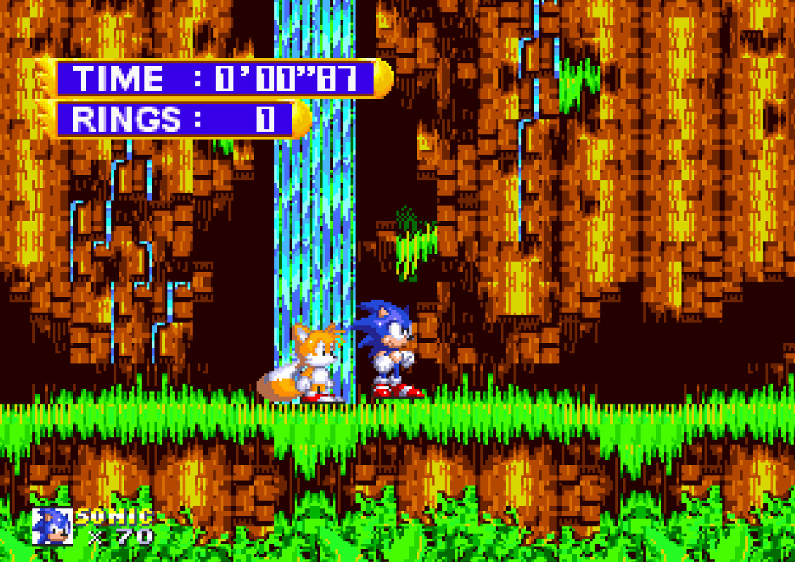
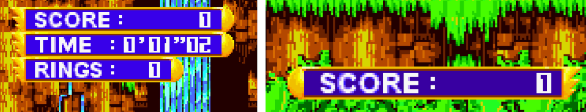

# Sonic World (Sonic Jam) HUD Port for Sonic 3 A.I.R.

A mod that ports the hud from "Sonic World" in Sonic Jam, in Sonic 3 Angel Island Revisited.

As an extra, the score counter can be renabled with two custom-made styles:
- One based on the existing rings and time counters. This is the default style.
- One based on the string that apparers when standing close to a museum entrance.  

**This mod may not work or break other mods that change the hud, especially those that use scripting.**

Tools Used:  
Mednafen - Saturn Emulator, used to make pixel perfect screenshots of the game.  
Aseprite - Used to make a spritesheet out of the game screenshots, and to make the custom sprites.

Credits: 
Hex Falc - Mod Creator and Sprite Ripper.  
SammyGoesHowdy - Inspiration (This mod was kinda inspired by his jam pause menu but I already had the idea for the mod even before that released).  
Eukaryout - Creator of Sonic 3 Angel Island Revisited  
Sega and Sonic Team - Created Sonic Jam
